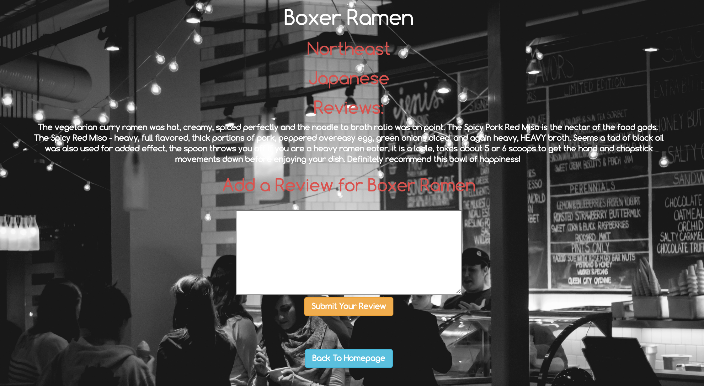

# _PDX Foods_

#### _A website where users can search restaurants by location and type of cuisine, and add reviews to each restaurant._

#### By _**Ashley Maceli**_

## Setup/Installation Requirements

* _SETTING UP THE DATABASE AND TEST DATABASE_
* _Clone repository to desktop_
* _Use console to enter directory with all files_
* _In a new console window run the command 'postgres' and keep running_
* _In a new console window run the command 'psql' then 'CREATE DATABASE pdx_foods;'_
* _In the same console window run the command 'psql' then 'CREATE DATABASE pdx_foods_test;'_
* _In bash console run the command 'psql pdx_foods < pdx_foods.sql' to properly download the database file into the empty database you just created_
* _In the same bash console run the command 'psql pdx_foods_test < pdx_foods_test.sql' to properly download the database file into the empty database you just created_
* _(Alternative to downloading test database file: Run the command '\c pdx_foods' to connect to the database. To create the test database run the command 'CREATE DATABASE pdx_foods_test WITH TEMPLATE pdx_foods;')_
* _RUNNING THE WEB APP_
* _In console run the command 'gradle run'_
* _Open your browser and go to http://localhost:4567/_

## Known Bugs

_No known bugs at this time_

## Support and contact details

_For all issues and support, please contact:
Ashley Maceli at ashley.maceli@gmail.com_

## Technologies Used

_Java, SQL, Spark, Velocity, HTML, CSS, Gradle, JUnit, FluentLenium_

### License

The MIT License (MIT)

Copyright (c) 2016 Ashley Maceli

Permission is hereby granted, free of charge, to any person obtaining a copy
of this software and associated documentation files (the "Software"), to deal
in the Software without restriction, including without limitation the rights
to use, copy, modify, merge, publish, distribute, sublicense, and/or sell
copies of the Software, and to permit persons to whom the Software is
furnished to do so, subject to the following conditions:

The above copyright notice and this permission notice shall be included in all
copies or substantial portions of the Software.

THE SOFTWARE IS PROVIDED "AS IS", WITHOUT WARRANTY OF ANY KIND, EXPRESS OR
IMPLIED, INCLUDING BUT NOT LIMITED TO THE WARRANTIES OF MERCHANTABILITY,
FITNESS FOR A PARTICULAR PURPOSE AND NONINFRINGEMENT. IN NO EVENT SHALL THE
AUTHORS OR COPYRIGHT HOLDERS BE LIABLE FOR ANY CLAIM, DAMAGES OR OTHER
LIABILITY, WHETHER IN AN ACTION OF CONTRACT, TORT OR OTHERWISE, ARISING FROM,
OUT OF OR IN CONNECTION WITH THE SOFTWARE OR THE USE OR OTHER DEALINGS IN THE
SOFTWARE.
